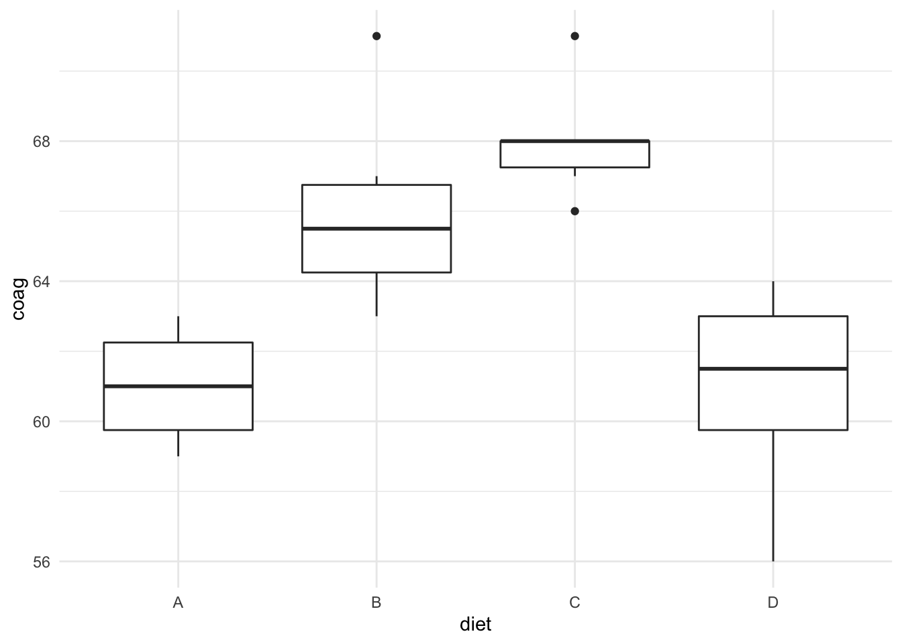

# Básicos de INLA {#inlabasics}

## Presentación

INLA es una librería de R que aproxima la inferencia Bayesiana para
modelos gausianos latentes (LGM). Sus siglas provienen de Integrated
Nested Laplace Approximation (INLA), que es un método para aproximar las
inferencias bayesianas a través de la aproximación de Laplace.

Aunque la metodología INLA se ha desarrollado sobre modelos que se
pueden expresar como campos aleatorios markovianos gausianos (\*Gaussian
Markov random fields, GMRF), es viable para una gran familia de modelos
habituales en la práctica estadística.

Disponemos de referencias múltiples y documentación de esta librería en
la web [r-inla.org](https://www.r-inla.org), y en particular en el
manual de referencia de Gómez-Rubio (2021) titulado [Bayesian inference
with
INLA](https://becarioprecario.bitbucket.io/inla-gitbook/index.html),
también publicado por [Chapman & Hall-CRC
Press](https://www.routledge.com/Bayesian-inference-with-INLA/Gomez-Rubio/p/book/9781138039872).

## Instalación

Para instalar la librería INLA hemos de ejecutar, desde R, el comando

    install.packages("INLA", repos=c(getOption("repos"), INLA="https://inla.r-inla-download.org/R/stable"), dep=TRUE)

    # y a continuación la cargamos con:
    library(INLA)

Para instalar actualizaciones, basta con ejecutar

`` options(repos = c(getOption("repos"), INLA="https://inla.r-inla-download.org/R/testing"))` y después `update.packages("INLA", dep=TRUE) ``

Las descargas y documentación completa sobre INLA está disponible en
[R-INLA home](http://www.r-inla.org/home).

Ya desde R, para pedir ayuda sobre funciones en INLA, basta usar el
comando `inla.doc()`, especificando dentro y entrecomillada, la
función/objeto sobre el que se solicita ayuda. Por ejemplo,
`inla.doc("ar1")` o `inla.doc("loggamma")`.

## Bases

INLA está basado en la resolución de integrales vía la aproximación de
Laplace, que aproxima el integrando a través de una expansión de Taylor
de segundo grado que permite calcular la integral analíticamente.
\begin{eqnarray*}
I_n&=&\int_x exp[nf(x)]dx \\
&\approx& \int_x exp[n(f(x_0)+1/2 (x-x_0)^2 f''(x_0))] dx \\
&=& exp[nf(x_0)] \cdot \sqrt{\frac{2\pi}{-n f''(x_0)}}
\end{eqnarray*}

Evita así los largos tiempos de simulación de las cadenas de Markov
Monte Carlo. Cuando las distribuciones a integrar son Gausianas, Laplace
da órdenes buenos de aproximación. Y este es el principio que usa para
modelizar la mayoría de los modelos habituales, que se integran dentro
de la amplia clase de los modelos gausianos latentes, en los que se
aplica INLA.

INLA se ha aplicado en mapeo estadístico, modelos de cohorte
multidimensionales, modelos de asociación espacial, genética, análisis
medioambientales, salud y epidemiología, dinámicas de infecciones,
estudios agronómicos, meta-análisis, impacto del cambio climático y
muchos más ámbitos (ampliar en @rue_et_al2017).

## Comparación de poblaciones normales

Vamos a ilustrar los fundamentos de INLA a través de un problema
sencillo de Anova para comparar poblaciones normales. Los datos
provienen de la librería `faraway` [@faraway22] y se refieren a un
estudio de tiempos de coagulación de la sangre; 24 animales fueron
asignados aleatoriamente a diferentes dietas y posteriormente se tomaron
muestras de los tiempos de coagulación.


```r
data(coagulation)
str(coagulation)
#> 'data.frame':	24 obs. of  2 variables:
#>  $ coag: num  62 60 63 59 63 67 71 64 65 66 ...
#>  $ diet: Factor w/ 4 levels "A","B","C","D": 1 1 1 1 2 2 2 2 2 2 ...
ggplot(coagulation,aes(x=diet,y=coag))+
  geom_boxplot()
```



Por hacerlo todavía más sencillo, nos vamos a confinar a comparar las
dietas A y B exclusivamente. Procedamos pues con la modelización para
resolver el problema de comparación que se nos plantea.

### Ajuste con INLA: fórmula

Entendemos como variable respuesta $y=coag$, de tipo numérico
(continua), y como variable explicativa o clasificadora, `diet`, con dos
niveles de respuesta (A y B).

Esto nos lleva ya a poder especificar el modelo que queremos ajustar
sobre los datos. En INLA hay que hacerlo a través de una fórmula del
tipo 

```
formula= y ~ 1+ x
```

donde $y$ es la respuesta *coag* y
$x$ es la variable clasificadora *diet* en nuestro caso. Realmente la interceptación, identificada por el $1$ en la fórmula, no es preciso especificarla, pues el ajuste siempre se resolverá con su estimación, salvo que se especifique lo contrario.

En nuestro problema tendríamos pues,


```r
formula = coag ~ diet
```

A continuación es procedente elegir el modelo sobre la respuesta, o lo
que es lo mismo, la verosimilitud.

### Ajuste con INLA: verosimilitud

En principio es razonable, por la simetría de las cajas, asumir
normalidad en la respuesta; además todas las observaciones son
independientes, dado cómo se ha realizado la toma de datos. Puesto que
el objetivo es comparar las dos dietas, es lógico considerar a priori
tiempos medios de coagulación distintos, $\mu_A$ y $\mu_B$. Dado el
gráfico, es razonable también asumir varianzas $\sigma^2$ similares en
torno a sus medias (ver la amplitud de las cajas). Así, la verosimilitud
se obtendrá del siguiente modelo para la respuesta:

$$(y_i|\mu,\sigma^2) \sim N(\mu_i,\sigma^2), \ \ i=A,B.$$ Veamos cómo
especificarlo en INLA.

La función `name(inla.models())` proporciona un listado de todos los
tipos de modelos posibles para datos (*likelihood*), parámetros
(*prior*), hiperparámetros (*latent*), ... Es más, el listado completo
de todas las distribuciones disponibles para cada uno de los tipos de
modelos lo obtenemos con el comando `inla.list.models()`

En particular, si ejecutamos `names(inla.models()$likelihood)` obtenemos
todas las distribuciones disponibles para modelizar los datos. La
distribución `gaussian` identifica la distribución normal que buscamos.
Para obtener información sobre cómo está parametrizada y cuáles son los
hiperparámetros por defecto, basta consultar la documentación:


    # documentación (parametrización y valores por defecto)
    inla.doc("gaussian")


Para ajustar un modelo sencillo en INLA utilizando la configuración por
defecto para las priors (información difusa) basta llamar a la función
`inla`, especificar la fórmula, a continuación la verosimilitud asumida
en el argumento `family`, y el data.frame en el que están los datos

    fit=inla(formula,family="gaussian", data,
        control.x,control.predictor=list(compute=TRUE))

El argumento `control.predictor=list(compute=TRUE)` permite obtener las distribuciones predictivas para la respuesta. Por defecto dejamos activa esta opción incluyendo el argumento.


Adelantamos pues un paso más, añadiendo la verosimilitud normal y la
base de datos:

    # selección de solo dos tratamientos: A y B
    datos=coagulation %>%
      filter(diet %in% c("A","B"))
    formula=coag~diet
    fit=inla(formula,family="gaussian",datos,...)

Sin embargo, falta información previa por especificar sobre los
parámetros desconocidos, esto es, sobre $\mu_A,mu_B,\sigma^2$. Puesto
que carecemos de información previa, utilizaremos a prioris vagas para
los parámetros en la verosimilitud: 

- para las medias $\mu_A,mu_B$ es
razonable asumir entonces una normal difusa y centrada en el cero 
- para la varianza $\sigma^2$, ante ausencia de información, es habitual asumir
una gamma inversa difusa (con media y varianza grandes).

```{=tex}
\begin{eqnarray*}
\mu_i &\sim& N(0,\sigma_{\mu}^2) \\
\sigma^2 &\sim & GaI(\alpha,\beta)
\end{eqnarray*}
```

### Ajuste con INLA: varianza

En INLA, en lugar de asignar distribuciones a priori sobre las
varianzas, se hace sobre el logaritmo de las precisiones, para facilitar
el cálculo del máximo de la log-posterior (obtenida de la
log-verosimilitud y la log-prior). Así, asumir una gamma inversa difusa
$GaI(\alpha,\beta)$ para la varianza es equivalente a una Gamma difusa
$Ga(\alpha,\beta)$ para la precisión $\gamma=1/\sigma^2$, y una
log-gamma difusa $Log-Gamma(\alpha,\beta)$ para la log-precisión
$log(\gamma)$.

Por defecto, INLA utiliza para la log-precisión (que identifica en su
documentación como *theta1*), la log-gamma difusa
$$\theta_1=log(1/\sigma^2) \sim LGa(1,5\cdot 10^{-5})$$ que representa
un valor esperado para la precisión $1/\sigma^2$ de $2\cdot 10^4$ y una
varianza de $4\cdot 10^8$.

Por supuesto, si tenemos información previa sobre esta precisión,
podemos modificarla a través del argumento `control.family` en la
función `inla`. Dicho argumento requiere de una lista con el nombre de
los hiperparámetros a modelizar, y a su vez cada hiperparámetro
conteniendo una lista con la distribución y los parámetros a utilizar.


```
# en el caso de querer modificar la precisión:
prec.info = list(prior="loggamma", param=c(0.001,0.001))
fit<-inla(formula,family="gaussian",data,
    control.family=list(hyper=list(prec=prec.info)))
```

### Ajuste con INLA: efectos fijos

Una variable explicativa entra en el modelo como **efecto fijo** cuando
se piensa que afecta a todas las observaciones del mismo modo (de un
modo lineal), y que su efecto es de interés primario en el estudio. En
un contexto bayesiano un efecto fijo tendrá un coeficiente asociado al
que se le asigna a menudo una distribución a priori vaga (mínimo
informativa), como una gausiana con media cero y varianza (conocida)
grande. 

Las distribuciones a priori sobre los efectos fijos, esto es, la interceptación y los coeficientes de covariables, se pueden especificar y modificar con el argumento `control.fixed` en la función de ajuste `inla`. Con el comando `inla.set.control.fixed.default()` conseguimos un listado completo con las opciones disponibles y los valores por defecto que se usan.

-   *mean.intercept* y *prec.intercept* son la media y la precisión de la prior normal para la interceptación. 
-   *mean* y *prec* son la media y precisión de la prior normal para un coeficiente vinculado a un efecto fijo.

La lista de las diferentes distribuciones a priori implementadas en
INLA, así como la documentación en pdf de las mismas, se obtiene con:

```
names(inla.models()$prior)
inla.doc("loggamma")
inla.models()$prior$loggamma
```


Nuestro modelo asume que la dieta (*diet*) influye en el tiempo de
coagulación, y nos interesa además, saber cómo. Estamos pues ante un
efecto fijo. Además, ante ausencia de información asumimos independencia
entre $\mu_A,\mu_B$ y distribuciones normales difusas idénticas,
centradas en el cero.

$$\mu_i \sim_{iid} N(0,\sigma^2_{diet}), \ i=A,B$$


## Verosimilitud

## Verosimilitud

La función `inla.models()` provides a summary of the different
likelihoods, latent models, etc. implemented in the INLA package and it
can be used to assess the internal parameterization used by INLA and the
default priors of the hyperparameters. Sólo el listado completo lo
conseguimos con el comando `inla.list.models()`.

| Value      | Description                                                |
|------------|------------------------------------------------------------|
| latent     | Latent models available                                    |
| group      | Models available when grouping observations                |
| link       | Link function available                                    |
| hazard     | Models for the baseline hazard function in survival models |
| likelihood | List of likelihoods available                              |
| prior      | List of priors available                                   |

Las distribuciones disponibles para la verosimilitud y para los efectos
aleatorios son:


```r
names(inla.models()$likelihood)
#>  [1] "poisson"                      
#>  [2] "xpoisson"                     
#>  [3] "cenpoisson"                   
#>  [4] "cenpoisson2"                  
#>  [5] "gpoisson"                     
#>  [6] "poisson.special1"             
#>  [7] "binomial"                     
#>  [8] "xbinomial"                    
#>  [9] "pom"                          
#> [10] "bgev"                         
#> [11] "gamma"                        
#> [12] "gammasurv"                    
#> [13] "gammajw"                      
#> [14] "gammajwsurv"                  
#> [15] "gammacount"                   
#> [16] "qkumar"                       
#> [17] "qloglogistic"                 
#> [18] "qloglogisticsurv"             
#> [19] "beta"                         
#> [20] "betabinomial"                 
#> [21] "betabinomialna"               
#> [22] "cbinomial"                    
#> [23] "nbinomial"                    
#> [24] "nbinomial2"                   
#> [25] "simplex"                      
#> [26] "gaussian"                     
#> [27] "agaussian"                    
#> [28] "circularnormal"               
#> [29] "wrappedcauchy"                
#> [30] "iidgamma"                     
#> [31] "iidlogitbeta"                 
#> [32] "loggammafrailty"              
#> [33] "logistic"                     
#> [34] "sn"                           
#> [35] "gev"                          
#> [36] "lognormal"                    
#> [37] "lognormalsurv"                
#> [38] "exponential"                  
#> [39] "exponentialsurv"              
#> [40] "coxph"                        
#> [41] "weibull"                      
#> [42] "weibullsurv"                  
#> [43] "loglogistic"                  
#> [44] "loglogisticsurv"              
#> [45] "weibullcure"                  
#> [46] "stochvol"                     
#> [47] "stochvolsn"                   
#> [48] "stochvolt"                    
#> [49] "stochvolnig"                  
#> [50] "zeroinflatedpoisson0"         
#> [51] "zeroinflatedpoisson1"         
#> [52] "zeroinflatedpoisson2"         
#> [53] "zeroinflatedcenpoisson0"      
#> [54] "zeroinflatedcenpoisson1"      
#> [55] "zeroinflatedbetabinomial0"    
#> [56] "zeroinflatedbetabinomial1"    
#> [57] "zeroinflatedbinomial0"        
#> [58] "zeroinflatedbinomial1"        
#> [59] "zeroinflatedbinomial2"        
#> [60] "zeroninflatedbinomial2"       
#> [61] "zeroninflatedbinomial3"       
#> [62] "zeroinflatedbetabinomial2"    
#> [63] "zeroinflatednbinomial0"       
#> [64] "zeroinflatednbinomial1"       
#> [65] "zeroinflatednbinomial1strata2"
#> [66] "zeroinflatednbinomial1strata3"
#> [67] "zeroinflatednbinomial2"       
#> [68] "t"                            
#> [69] "tstrata"                      
#> [70] "nmix"                         
#> [71] "nmixnb"                       
#> [72] "gp"                           
#> [73] "dgp"                          
#> [74] "logperiodogram"               
#> [75] "tweedie"                      
#> [76] "fmri"                         
#> [77] "fmrisurv"                     
#> [78] "gompertz"                     
#> [79] "gompertzsurv"
names(inla.models()$latent)
#>  [1] "linear"       "iid"          "mec"         
#>  [4] "meb"          "rgeneric"     "cgeneric"    
#>  [7] "rw1"          "rw2"          "crw2"        
#> [10] "seasonal"     "besag"        "besag2"      
#> [13] "bym"          "bym2"         "besagproper" 
#> [16] "besagproper2" "fgn"          "fgn2"        
#> [19] "ar1"          "ar1c"         "ar"          
#> [22] "ou"           "intslope"     "generic"     
#> [25] "generic0"     "generic1"     "generic2"    
#> [28] "generic3"     "spde"         "spde2"       
#> [31] "spde3"        "iid1d"        "iid2d"       
#> [34] "iid3d"        "iid4d"        "iid5d"       
#> [37] "iidkd"        "2diid"        "z"           
#> [40] "rw2d"         "rw2diid"      "slm"         
#> [43] "matern2d"     "dmatern"      "copy"        
#> [46] "clinear"      "sigm"         "revsigm"     
#> [49] "log1exp"      "logdist"
# con descripción  con el comando
# inla.list.models("latent")
```

Para conseguir información sobre los hiperparámetros de un determinado
modelo, basta con identificar su tipo (sección) y nombre, invocando la
función `inla.models()`. Todos los hiperparámetros tienen una
denominación (*name*) y un nombre abreviado (*short.name*), así como una
descripción completa de su significado y tipo, cuestiones estas últimas
en base a las que ha de especificarse la distribución.

Por ejemplo, en el modelo *latent\$iid* para los efectos aleatorios de
dimensión 1, el hiperparámetro es el logaritmo de la precisión ("log
precision") aunque su nombre corto es "prec", la distribución a priori
una *Log-Gamma* con parámetros $(1, 5 \cdot 10^{-5})$ por defecto. Si
$log.precision \sim Log-Gamma (\alpha,\beta)$, entonces la precisión de
los efectos aleatorios $precision \sim Gamma (1,\theta)$, con valor
esperado $1/\theta=2 \cdot 10^4$, que implica una varianza esperada para
los efectos aleatorios de $5 \cdot 10^{-5}$. Cuando queramos modificar
estos valores $\alpha$ y $\beta$ o incluso la distribución a priori para
la precisión, habremos de apelar a sus argumentos "prior" y "param".


```r
inla.models()$latent$iid
#> $doc
#> [1] "Gaussian random effects in dim=1"
#> 
#> $hyper
#> $hyper$theta
#> $hyper$theta$hyperid
#> [1] 1001
#> attr(,"inla.read.only")
#> [1] FALSE
#> 
#> $hyper$theta$name
#> [1] "log precision"
#> attr(,"inla.read.only")
#> [1] FALSE
#> 
#> $hyper$theta$short.name
#> [1] "prec"
#> attr(,"inla.read.only")
#> [1] FALSE
#> 
#> $hyper$theta$prior
#> [1] "loggamma"
#> attr(,"inla.read.only")
#> [1] FALSE
#> 
#> $hyper$theta$param
#> [1] 1e+00 5e-05
#> attr(,"inla.read.only")
#> [1] FALSE
#> 
#> $hyper$theta$initial
#> [1] 4
#> attr(,"inla.read.only")
#> [1] FALSE
#> 
#> $hyper$theta$fixed
#> [1] FALSE
#> attr(,"inla.read.only")
#> [1] FALSE
#> 
#> $hyper$theta$to.theta
#> function (x) 
#> log(x)
#> <bytecode: 0x7f7b233e2ef8>
#> <environment: 0x7f7b233ea558>
#> attr(,"inla.read.only")
#> [1] TRUE
#> 
#> $hyper$theta$from.theta
#> function (x) 
#> exp(x)
#> <bytecode: 0x7f7b233e2de0>
#> <environment: 0x7f7b233ea558>
#> attr(,"inla.read.only")
#> [1] TRUE
#> 
#> 
#> 
#> $constr
#> [1] FALSE
#> 
#> $nrow.ncol
#> [1] FALSE
#> 
#> $augmented
#> [1] FALSE
#> 
#> $aug.factor
#> [1] 1
#> 
#> $aug.constr
#> NULL
#> 
#> $n.div.by
#> NULL
#> 
#> $n.required
#> [1] FALSE
#> 
#> $set.default.values
#> [1] FALSE
#> 
#> $pdf
#> [1] "indep"
names(inla.models()$latent$iid$hyper)
#> [1] "theta"
```

    # Información completa sobre el hiperparámetro
    inla.models()$latent$iid$hyper$theta

    inla.models()$latent$iid$hyper$theta$name
    inla.models()$latent$iid$hyper$theta$short.name
    inla.models()$latent$iid$hyper$theta$prior
    inla.models()$latent$iid$hyper$theta$param

## Información a priori

En estadística Bayesiana, los datos se modelizan a través de la
verosimilitud, que depende de ciertos parámetros. Cuando especificamos
una distribución a priori para estos parámetros, hemos de hacerlo a
través del argumento **hyper** dentro de la opción **control.family**.
Cuando la información a priori que tenemos sobre estos parámetros
depende a su vez de otros parámetros implícitos en su distribución a
priori, la distribución de esos hiperparámetros se hará a través del
argumento **hyper** dentro de la función **f()**.

Ejemplo. Sea el modelo
$$y_{ij} | \mu_i,\sigma^2 \sim N(\mu_i,\sigma^2)$$ que define la
verosimilitud para los datos a través de un modelo normal, con media
$\mu_i$ para todas las observaciones que pertenecen al mismo grupo $i$.
A continuación se define la información disponible sobre $\mu_i$ y
$\sigma^2$, que son parámetros en la verosimilitud.
$$\mu_i|\mu,\tau^2 \sim N(\mu,\tau^2) $$
$$ \sigma^2 \sim Inv-Gamma (\alpha,\beta)$$, con valores concretos
$\alpha$ y $\beta$ definidos por el usuario.

The parameters of the priors on the fixed effects (i.e., intercept and
coefficients) can be changed with option 'control.fixed' in the call to
inla(), which sets some of the options for the fixed effects. Table 2.1
displays a summary of the different options and their default values. A
complete list of options and their default values can be obtained by
running 'inla.set.control.fixed.default()'.

-   *mean.intercept* and *prec.intercept* are the mean and precision of
    Gaussian prior on the intercept
-   *mean* and *prec* are the mean and precision of Gaussian prior on a
    coefficient.

Estas dos distribuciones se definen como *hyper* en *control.family*. A
su vez, la información previa sobre los hiperparámetros $\mu$ y $\tau^2$
habrá de definirse a través del argumento **hyper** dentro de la función
**f()**.

La lista de las diferentes distribuciones a priori implementadas en
INLA, así como la documentación en pdf de las mismas, se obtiene con


```r
names(inla.models()$prior)
#>  [1] "normal"                 "gaussian"              
#>  [3] "linksnintercept"        "wishart1d"             
#>  [5] "wishart2d"              "wishart3d"             
#>  [7] "wishart4d"              "wishart5d"             
#>  [9] "loggamma"               "gamma"                 
#> [11] "minuslogsqrtruncnormal" "logtnormal"            
#> [13] "logtgaussian"           "flat"                  
#> [15] "logflat"                "logiflat"              
#> [17] "mvnorm"                 "pc.alphaw"             
#> [19] "pc.ar"                  "dirichlet"             
#> [21] "none"                   "invalid"               
#> [23] "betacorrelation"        "logitbeta"             
#> [25] "pc.prec"                "pc.dof"                
#> [27] "pc.cor0"                "pc.cor1"               
#> [29] "pc.fgnh"                "pc.spde.GA"            
#> [31] "pc.matern"              "pc.range"              
#> [33] "pc.sn"                  "pc.gamma"              
#> [35] "pc.mgamma"              "pc.gammacount"         
#> [37] "pc.gevtail"             "pc"                    
#> [39] "ref.ar"                 "pom"                   
#> [41] "jeffreystdf"            "wishartkd"             
#> [43] "expression:"            "table:"
# inla.doc("loggamma")
inla.models()$prior$loggamma
#> $doc
#> [1] "Log-Gamma prior"
#> 
#> $nparameters
#> [1] 2
#> 
#> $pdf
#> [1] "prior-loggamma"
```

Para definir una prior para los parámetros e hiperparámetros en INLA hay
que definir los siguientes argumentos:

-   prior, el nombre de la distribución a priori
-   param, los valores de los parámetros de la prior
-   initial, el valor inicial para el hiperparámetro
-   fixed, si ha de guardar el valor fixed en initial

Sea el modelo $y_{ij}|\mu,\theta_i \sim N(\mu+\theta_i,\sigma^2)$, donde
$\theta_i$ los interpretamos como efectos aleatorios vinculados al grupo
al que pertenece la medición $y_{ij}$. La distribución a priori para la
precisión $\mu$ es una normal mínimo informativa (media 0 y varianza
alta). El logaritmo de la precisión $\tau=1/sigma^2$ se modeliza a
priori (por defecto) con una log-gamma. La distribución a priori para
Los efectos aleatorios $\theta_i \sim N(0, \sigma_{\theta}^2)$. Hemos de
especificar una prior para la precisión de los efectos aleatorios
$\tau_{\theta}=1/sigma_{\theta}^2$. Simulamos datos para él y
especificamos la prior para


```r
x<-runif(100,1,10)
y<-rnorm(100,5*x,10)
datos<-data.frame(cbind(x,y))
prec.prior <- list(prec = list(prior = "loggamma", 
                   param = c(0.01, 0.01)),initial = 4, fixed = FALSE)
formula <- y ~ 1 + f(x, model = "iid")
result<-inla(formula,family="gaussian",data=datos)
summary(result)
#> 
#> Call:
#>    c("inla.core(formula = formula, family = family, 
#>    contrasts = contrasts, ", " data = data, quantiles = 
#>    quantiles, E = E, offset = offset, ", " scale = 
#>    scale, weights = weights, Ntrials = Ntrials, strata = 
#>    strata, ", " lp.scale = lp.scale, link.covariates = 
#>    link.covariates, verbose = verbose, ", " lincomb = 
#>    lincomb, selection = selection, control.compute = 
#>    control.compute, ", " control.predictor = 
#>    control.predictor, control.family = control.family, 
#>    ", " control.inla = control.inla, control.fixed = 
#>    control.fixed, ", " control.mode = control.mode, 
#>    control.expert = control.expert, ", " control.hazard 
#>    = control.hazard, control.lincomb = control.lincomb, 
#>    ", " control.update = control.update, 
#>    control.lp.scale = control.lp.scale, ", " 
#>    control.pardiso = control.pardiso, only.hyperparam = 
#>    only.hyperparam, ", " inla.call = inla.call, inla.arg 
#>    = inla.arg, num.threads = num.threads, ", " 
#>    blas.num.threads = blas.num.threads, keep = keep, 
#>    working.directory = working.directory, ", " silent = 
#>    silent, inla.mode = inla.mode, safe = FALSE, debug = 
#>    debug, ", " .parent.frame = .parent.frame)") 
#> Time used:
#>     Pre = 2.39, Running = 0.217, Post = 0.0348, Total = 2.64 
#> Fixed effects:
#>               mean    sd 0.025quant 0.5quant 0.975quant
#> (Intercept) 30.227 1.735     26.819   30.227     33.635
#>             mode kld
#> (Intercept)   NA   0
#> 
#> Random effects:
#>   Name	  Model
#>     x IID model
#> 
#> Model hyperparameters:
#>                                             mean       sd
#> Precision for the Gaussian observations 3.00e-03     0.00
#> Precision for x                         2.65e+04 26184.14
#>                                         0.025quant 0.5quant
#> Precision for the Gaussian observations      0.003 3.00e-03
#> Precision for x                           3170.038 1.79e+04
#>                                         0.975quant mode
#> Precision for the Gaussian observations   4.00e-03   NA
#> Precision for x                           1.01e+05   NA
#> 
#> Marginal log-Likelihood:  -444.12 
#>  is computed 
#> Posterior summaries for the linear predictor and the fitted values are computed
#> (Posterior marginals needs also 'control.compute=list(return.marginals.predictor=TRUE)')
```

## Resultados

Para mostrar los resultados del ajuste obtenido con `fit=inla(...)`,
utilizamos la sintaxis siguiente:

-   `summary(fit)`: proporciona una descriptiva del ajuste
-   `fit$summary.fixed` y `fit$summary.random` dan respectivamente los
    resúmenes de la inferencia posterior sobre los efectos fijos y
    aleatorios
-   `fit$summary.fitted.values` y `fit$summary.linear.predictor` dan,
    respectivamente, los descriptivos de los valores ajustados y de los
    predictores lineales (relevante si son distintos)
-   `fit$summary.hyperpar` da un resumen de la inferencia posterior de
    los hiperparámetros
-   `fit$marginals.fitted.values` y `fit$marginals.linear.predictor` da
    las distribuciones posteriores marginales para los valores ajustados
    y predictores lineales respectivamente.
-   `fit$marginals.fixed` y `fit$marginals.random` da las distribuciones
    posteriores marginales de los efectos fijos y aleatorios
-   `fit$mlik` da la estimación de la verosimilitud marginal.

Además, podemos recuperar los nombres de todos los parámetros y
variables involucradas en el modelo con `names(fit$marginals.fixed)` o
`names(fit$marginals.random)` para los efectos fijos y aleatorios, o
`names(fit.inla$marginals.hyperpar)` para los nombres de los
hiperparámetros.

Para utilizar de modo individualizado cada uno de los parámetros
asociados a los efectos fijos, recurrimos a la sintaxis
`fit.inla$marginals.fixed$x`, con `x` el nombre del efecto, o
seleccionándolo con su ordinal en el conjunto de efectos fijos
`fit.inla$marginals.fixed[[1]]`. De forma similar procedemos con el
resto de parámetros (efectos aleatorios e hiperparámetros).

Veamos un ejemplo rápido de regresión lineal múltiple con una base de
datos de la librería `MASS`.


```r
library(MASS)
m1 <- inla(y ~ x1 + x2 + x3 + x4, data = cement)
summary(m1)
#> 
#> Call:
#>    c("inla.core(formula = formula, family = family, 
#>    contrasts = contrasts, ", " data = data, quantiles = 
#>    quantiles, E = E, offset = offset, ", " scale = 
#>    scale, weights = weights, Ntrials = Ntrials, strata = 
#>    strata, ", " lp.scale = lp.scale, link.covariates = 
#>    link.covariates, verbose = verbose, ", " lincomb = 
#>    lincomb, selection = selection, control.compute = 
#>    control.compute, ", " control.predictor = 
#>    control.predictor, control.family = control.family, 
#>    ", " control.inla = control.inla, control.fixed = 
#>    control.fixed, ", " control.mode = control.mode, 
#>    control.expert = control.expert, ", " control.hazard 
#>    = control.hazard, control.lincomb = control.lincomb, 
#>    ", " control.update = control.update, 
#>    control.lp.scale = control.lp.scale, ", " 
#>    control.pardiso = control.pardiso, only.hyperparam = 
#>    only.hyperparam, ", " inla.call = inla.call, inla.arg 
#>    = inla.arg, num.threads = num.threads, ", " 
#>    blas.num.threads = blas.num.threads, keep = keep, 
#>    working.directory = working.directory, ", " silent = 
#>    silent, inla.mode = inla.mode, safe = FALSE, debug = 
#>    debug, ", " .parent.frame = .parent.frame)") 
#> Time used:
#>     Pre = 2.06, Running = 0.143, Post = 0.013, Total = 2.22 
#> Fixed effects:
#>               mean     sd 0.025quant 0.5quant 0.975quant
#> (Intercept) 62.507 69.831    -77.043   62.497    202.118
#> x1           1.550  0.742      0.066    1.550      3.033
#> x2           0.509  0.721     -0.933    0.509      1.951
#> x3           0.101  0.752     -1.403    0.101      1.604
#> x4          -0.145  0.707     -1.558   -0.145      1.267
#>             mode kld
#> (Intercept)   NA   0
#> x1            NA   0
#> x2            NA   0
#> x3            NA   0
#> x4            NA   0
#> 
#> Model hyperparameters:
#>                                         mean    sd
#> Precision for the Gaussian observations 0.21 0.096
#>                                         0.025quant 0.5quant
#> Precision for the Gaussian observations      0.068    0.195
#>                                         0.975quant mode
#> Precision for the Gaussian observations       0.42   NA
#> 
#> Marginal log-Likelihood:  -59.52 
#>  is computed 
#> Posterior summaries for the linear predictor and the fitted values are computed
#> (Posterior marginals needs also 'control.compute=list(return.marginals.predictor=TRUE)')
m1$summary.fixed
#>                   mean         sd   0.025quant   0.5quant
#> (Intercept) 62.5069435 69.8309658 -77.04305742 62.4969114
#> x1           1.5500045  0.7422389   0.06605503  1.5501130
#> x2           0.5091325  0.7213232  -0.93299004  0.5092348
#> x3           0.1008055  0.7521347  -1.40292482  0.1009145
#> x4          -0.1450792  0.7066331  -1.55783317 -0.1449787
#>             0.975quant mode          kld
#> (Intercept) 202.118436   NA 7.332571e-07
#> x1            3.033289   NA 7.339641e-07
#> x2            1.950629   NA 7.337634e-07
#> x3            1.603867   NA 7.336315e-07
#> x4            1.267058   NA 7.336061e-07
```

Hay una serie de funciones que operan sobre las distribuciones
posteriores marginales, y que podemos consultar con `?inla.marginal`:

-   `inla.dmarginal(x, marginal, log = FALSE)`: densidad
-   `inla.pmarginal(q, marginal, normalize = TRUE, len = 2048L)`:
    probabilidades
-   `inla.qmarginal(p, marginal, len = 2048L)`: cuantiles
-   `inla.rmarginal(n, marginal)`: simulaciones
-   `inla.hpdmarginal(p, marginal, len = 2048L)`: HPD interval
-   `inla.smarginal(marginal, log = FALSE, extrapolate = 0.0, keep.type = FALSE, factor=15L)`:
-   `inla.emarginal(fun, marginal, ...)`: la media
-   `inla.mmarginal(marginal)`
-   `inla.tmarginal(fun, marginal, n=2048L, h.diff = .Machine$double.eps^(1/3),method = c("quantile", "linear"))`:
    la densidad sobre una transformación t de la variable
-   `inla.zmarginal(marginal, silent = FALSE)`
